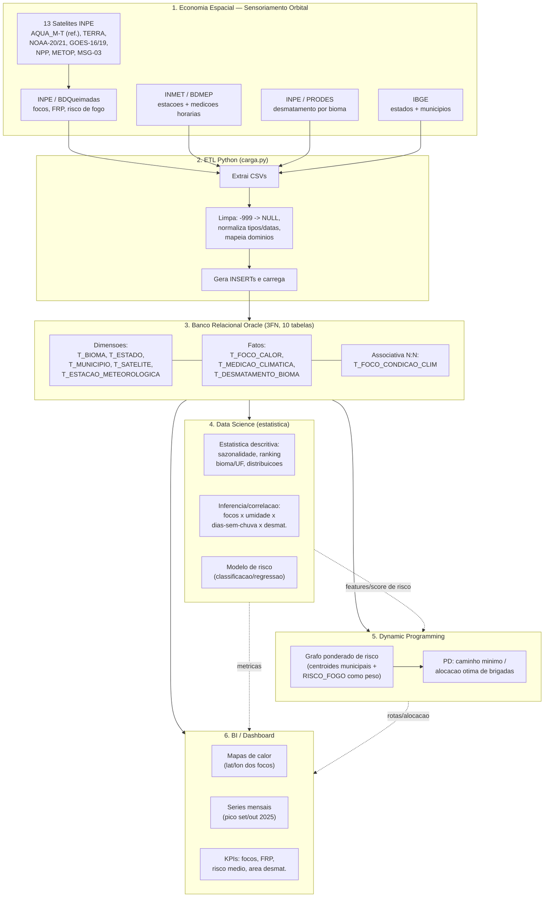

# Item 7 — Arquitetura Integrada

**Sistema de Detecção de Incêndios Florestais** — Grupo Stratfy (FIAP GS 2026.1)
Tema macro: **Economia Espacial**

Este documento entrega o **item 7** que faltava no design original do banco: como a camada
de dados desta disciplina (Database Design) se conecta, de ponta a ponta, com as demais
disciplinas do projeto Stratfy — do **satélite** ao **dashboard**.

---

## 1. Visão de ponta a ponta

A solução segue uma arquitetura de **pipeline de dados orientada a um banco relacional
central**, que atua como *fonte única de verdade* (single source of truth):

```
Satélite/INPE → ETL Python → Banco Relacional (Oracle) → Data Science (estatística)
                                     │
                                     ├──→ Dynamic Programming (grafos de risco)
                                     │
                                     └──→ BI / Dashboard
```

A "Economia Espacial" é o que **origina o dado**: sem a constelação de satélites de
sensoriamento remoto não existiria detecção de focos de calor em escala continental. O banco
relacional é o que **organiza, integra e disponibiliza** esse dado para análise, otimização
e decisão.

---

## 2. Diagrama (Mermaid)



---

## 3. Detalhamento das camadas

### 3.1. Camada 1 — Satélite / INPE (Economia Espacial)
A constelação de **13 satélites** (referência **AQUA_M-T**) detecta anomalias térmicas e
calcula **FRP** (Fire Radiative Power) e **risco de fogo**. Em 2025 foram **3.466.399 focos**
no Brasil. Complementam o dado primário: **INMET** (clima), **PRODES** (desmatamento) e
**IBGE** (malha territorial). Esta é a contribuição direta da "Economia Espacial": a
infraestrutura orbital que torna o monitoramento possível.

### 3.2. Camada 2 — ETL Python (esta disciplina)
`etl/carga.py` faz **Extract-Transform-Load**: lê os CSVs, converte o sentinela `-999` em
`NULL`, normaliza datas/timestamps, casa nomes textuais com códigos oficiais (UF, município
IBGE, bioma, satélite) e gera os `INSERT`. O mesmo ETL **valida** a carga num mirror SQLite,
garantindo que todos os dados reais satisfazem PK/FK/UNIQUE/CHECK antes de chegar ao Oracle.

### 3.3. Camada 3 — Banco Relacional Oracle (esta disciplina)
Modelo em **3ª Forma Normal**, 10 tabelas, com **integridade referencial** completa e
**índices** para consultas analíticas. É o **ponto de integração**: todas as disciplinas
seguintes leem do mesmo modelo, eliminando inconsistências entre análises. Estrutura típica
de **modelagem dimensional** (dimensões + fatos), adequada tanto a OLTP de ingestão quanto a
OLAP de análise.

### 3.4. Camada 4 — Data Science (estatística)
Consome o banco via SQL para:
- **Descritiva:** sazonalidade (pico set/out), ranking de biomas (Cerrado e Amazônia no
  topo) e UFs (MATOPIBA + arco do desmatamento);
- **Inferencial/correlação:** relação entre focos e `UMIDADE_REL_PCT`, `NUM_DIAS_SEM_CHUVA`,
  `PRECIPITACAO_MM` e `AREA_SUPRIMIDA_KM2`;
- **Preditiva:** modelo de classificação/regressão do `RISCO_FOGO` a partir das condições
  climáticas e do bioma.
As *features* e o *score* de risco produzidos retornam ao banco e alimentam a otimização.

### 3.5. Camada 5 — Dynamic Programming (grafos de risco)
Os **centroides dos municípios** (`T_MUNICIPIO.LATITUDE/LONGITUDE`) viram **vértices** de um
grafo; o **risco de fogo** e a distância geográfica viram **pesos das arestas**. Sobre esse
grafo, programação dinâmica resolve problemas como **caminho mínimo** (rota ótima de uma base
de brigada até os focos de maior risco) e **alocação ótima de recursos** limitados
(mochila/partição) entre regiões críticas. O dado de entrada vem inteiramente do banco.

### 3.6. Camada 6 — BI / Dashboard
Camada de visualização executiva que lê as mesmas tabelas e consultas: **mapas de calor**
(lat/lon dos focos), **séries mensais** (evidenciando o pico de set/out 2025), **rankings**
de biomas/UFs e **KPIs** (total de focos, FRP médio, risco médio, área desmatada). Consome
também os resultados de Data Science (métricas) e Dynamic Programming (rotas/alocação).

---

## 4. Conexão com as outras disciplinas Stratfy

| Disciplina | Como usa o banco | Tabelas-chave |
|---|---|---|
| **Data Science** | Estatística e modelo de risco a partir das medições e focos | T_FOCO_CALOR, T_MEDICAO_CLIMATICA, T_DESMATAMENTO_BIOMA, T_FOCO_CONDICAO_CLIM |
| **Dynamic Programming** | Grafo de risco (vértices = municípios, peso = risco/distância) | T_MUNICIPIO, T_FOCO_CALOR |
| **BI / Dashboard** | Agregações e visualizações executivas | todas (via views/consultas) |
| **Java (DDD)** | Domínio de monitoramento espacial e autônomo mapeado ao mesmo modelo | dimensões + fatos |
| **Network / Infra** | Hospedagem do banco e da pipeline de ingestão | — |

O banco relacional é o **contrato de dados** comum: padroniza chaves (códigos IBGE, WMO,
biomas, satélites) e restrições, de modo que cada disciplina trabalhe sobre a mesma verdade.

---

## 5. Decisões de arquitetura relevantes

- **Banco central como fonte única de verdade** evita silos e divergência entre análises.
- **Modelo dimensional (dimensões + fatos)** equilibra ingestão (OLTP) e análise (OLAP).
- **Surrogate keys** (sequences) nas dimensões de domínio (bioma, satélite, estação,
  desmatamento, foco, medição) e **chaves naturais oficiais** onde existem (código IBGE de
  estado/município) — garante estabilidade e rastreabilidade.
- **Associativa N:N** (`T_FOCO_CONDICAO_CLIM`) liga cada foco à condição climática mais
  próxima no espaço-tempo, viabilizando a correlação clima × fogo da Data Science.
- **Validação automatizada** (mirror SQLite no ETL) assegura que o modelo é executável e
  que os dados reais respeitam todas as restrições, **antes** de carregar no Oracle.
